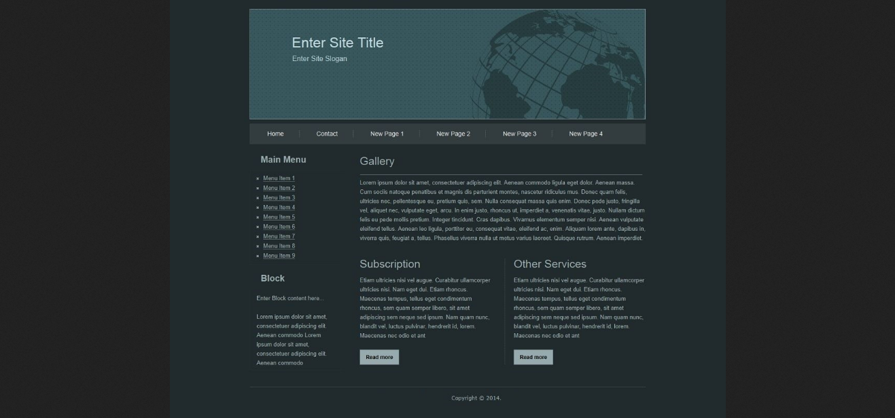

# HTML Challenges:

Fork the repository to your personal Github.

# Level 1:

Create an HTML file and name it “your name HTML 1":
This document should contain the following
* A Header and Footer element.
* At least one paragraph element.
* Uses three Heading types.
* Uses line breaks.
* Uses Quotations.
* Uses 3 formatting types.
* At least one image that should contain the alt attribute.

When completed push your file to GitHub.

* On verification you will get 5x 🔑

---------------
# Level 2:

Create an HTML file and name it "your name HTML 2"
It should contain the following:
* A style sheet.
* Style sheet should be linked to the HTML.
* A Header and a Footer.
* A menu with at least 4 items.
* An image and under it an unordered list of 5 items.
* In the footer, a hyperlink that takes you to codi.tech.
* Images should contain the alt attribute.

The main focus in this exercise is the HTML. Use minimal CSS to make the page readable and neat (colours, backgrounds, width, height, margin, padding.......)
When completed push your file to GitHub.

* On verification you will get 10x 🔑

-----------------

# Level 3:
Create an HTML file and name it "your name HTML 3"
It should contain the following:

* A style sheet.
* Style sheet should be linked to the HTML.
* Build a page that contains all the HTML elements in the image below:

* Add a small contact us form in the end of the page that contains:
* * Text input for: (name, email, message).
* * Radio button for: (complaint, suggestion).
* * Submit button.

The main focus in this exercise is the HTML. Use minimal CSS to make the page readable and neat (colours, backgrounds, width, height, margin, padding.......)
When completed push your file to github.

* On verification you will get 35x 🔑
